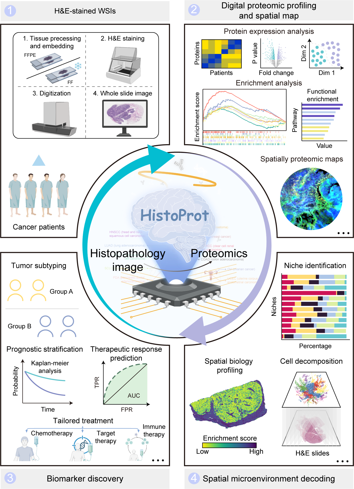

# HistoProt

HistoProt (Histology-based Proteomic Profiler) is a unified histology-to-proteomics framework that imputes bulk protein expression profiles and infers spatially resolved proteomic maps from routine H&E slides alone.
<p align="center">
  
</p>

The repository covers three major stages:

1. `01_data_processing`: whole-slide tiling, foundation-model feature extraction, proteomics preprocessing, and functional gene-set preprocessing.
2. `02_model_development`: hierarchical structure construction, HistoProt training, checkpoint-based inference, and post-processing utilities.
3. `03_downstream_analysis`: spatial proteomics reconstruction, marker/pathway visualization, cell type deconvolution, patch-embedding extraction, and niche identification.

The codebase is written as a practical research workflow rather than a single monolithic package. Most scripts provide command-line interfaces for either single-slide or batch processing.


## Repository Layout

```text
HistoProt/
|-- assets/
|   `-- graphical_abstract.png
|-- 01_data_processing/
|   |-- tiling_WSI_multi_thread.py
|   |-- get_foundation_model_features.py
|   |-- proteomics_processing.R
|   `-- functional_gene_set_enrichment.R
|-- 02_model_development/
|   |-- config.yaml
|   |-- train.py
|   |-- inference_results.py
|   |-- convert_hierarchical_structure.py
|   |-- convert_prediction_protein_accession_to_gene_name.py
|   `-- histoprot/
|-- 03_downstream_analysis/
|   |-- custom_analysis/
|   |-- spatial_profiling/
|   |-- cell_type_deconvolution/
|   `-- niche_analysis/
`-- README.md
```

## Important Note

The `datasets/` and `reference/` directories in this development snapshot are auxiliary local resources that were used for development, debugging, and testing. They are not required as part of the formal public workflow and should not be treated as mandatory inputs for external users.

## Environment

The pipeline is designed for Python 3.10+ and uses common scientific-computing libraries. Depending on the workflow stage, typical dependencies include:

- `torch`
- `pandas`
- `numpy`
- `pyarrow`
- `anndata`
- `scanpy`
- `scikit-learn`
- `matplotlib`
- `gseapy`
- `tangram`
- `pyyaml`
- `openslide-python`

Two preprocessing scripts are written in R:

- `01_data_processing/proteomics_processing.R`
- `01_data_processing/functional_gene_set_enrichment.R`

These require an R environment with the relevant proteomics and enrichment-analysis packages installed.

## Workflow

### 01_data_processing

This stage prepares the inputs required for model development. It covers WSI tiling, pathology foundation-model feature extraction, and optional preprocessing of bulk proteomics and function-level targets.

#### 01.1 Tile whole-slide images

Before running WSI tiling, organize raw whole-slide image files in a dedicated directory:

```text
dataset/
`-- WSIs/
    |-- slide_A.svs
    |-- slide_B.ndpi
    `-- slide_C.tif
```

The tiling script scans this directory, detects tissue regions, and exports one patch directory per slide.

```bash
python 01_data_processing/tiling_WSI_multi_thread.py \
  --wsi_dir ./dataset/WSIs \
  --output_dir ./dataset/patches
```

#### 01.2 Extract patch features from a pathology foundation model

Before feature extraction, patch images should be organized as one subdirectory per slide. Patch names should encode slide identity and patch coordinates:

```text
dataset/
`-- patches/
    |-- slide_A/
    |   |-- slide_A_(23.0,17.0).jpg
    |   |-- slide_A_(23.0,18.0).jpg
    |   `-- ...
    `-- slide_B/
```

This directory structure is consumed by `get_foundation_model_features.py`, which writes one slide-level feature table per slide.

```bash
python 01_data_processing/get_foundation_model_features.py \
  --model CONCH \
  --input_dir ./dataset/patches \
  --output_dir ./dataset/slides_features
```

#### 01.3 Optionally preprocess proteomics and function-level targets

If the downstream task uses matched bulk proteomics or function-level supervision, prepare target matrices before model training. Both `proteomics_processing.R` and `functional_gene_set_enrichment.R` are generic templates and should be configured by editing their script-level configuration blocks.

Target matrices should store one feature per row and one specimen per column. The first column should contain feature identifiers such as `protein_accession`, `gene_id`, or `gene_symbol`.

```text
protein_accession,specimen_001,specimen_002,specimen_003
P01009,8.31,8.10,7.94
P02647,5.22,5.01,5.17
Q9Y6X5,2.14,2.39,2.21
```

If needed, run:

```bash
Rscript 01_data_processing/proteomics_processing.R
Rscript 01_data_processing/functional_gene_set_enrichment.R
```

### 02_model_development

This stage converts WSIs into hierarchical representations, trains HistoProt, and generates slide-level digital proteomic profiles.

#### 02.1 Construct hierarchical WSI representation

Before hierarchical structure construction, each slide should already be represented as one Feather table containing patch-level feature vectors. Patch identifiers should be stored either as the table index or as a dedicated patch-name column. After foundation-model extraction, a typical slide table is organized as follows:

```text
index / patch_name                  feat_0001  feat_0002  ...  feat_0512
slide_A_(23.0,17.0).jpg             0.1532     -0.2910    ...  0.0084
slide_A_(23.0,18.0).jpg             0.1321     -0.1442    ...  0.0213
slide_A_(23.0,19.0).jpg             0.0954     -0.1887    ...  0.0149
```

`convert_hierarchical_structure.py` augments this representation with region assignments, producing the hierarchical WSI structure files used by HistoProt.

```bash
python 02_model_development/convert_hierarchical_structure.py \
  --input_dir ./dataset/slides_features/CONCH \
  --output_dir ./dataset/slides_features/CONCH_convert
```

#### 02.2 Train HistoProt

Before model training, prepare four aligned inputs:

1. A protein target matrix.
2. A functional target matrix.
3. A clinical metadata table linking specimens and slides.
4. A directory of hierarchical WSI feature Feather files from Section 02.1.

The clinical table should contain at least one specimen identifier column and one slide identifier column. An optional grouping column can be provided for nested cross-validation.

```text
specimens_id,slides_id,patient_id,cohort
specimen_001,slide_A,patient_01,group_1
specimen_002,slide_B,patient_02,group_1
specimen_003,slide_C,patient_03,group_2
```

At this stage, each slide feature table should typically contain patch identifiers, patch-level embedding features, and one region label column:

```text
index / patch_name                  feat_0001  feat_0002  ...  feat_0512  regions
slide_A_(23.0,17.0).jpg             0.1532     -0.2910    ...  0.0084     3
slide_A_(23.0,18.0).jpg             0.1321     -0.1442    ...  0.0213     3
slide_A_(23.0,19.0).jpg             0.0954     -0.1887    ...  0.0149     5
```

These paths and column names are configured in `02_model_development/config.yaml`. After editing the configuration file, run:

```bash
python 02_model_development/train.py \
  --config 02_model_development/config.yaml
```

#### 02.3 Predict slide-level digital proteomic profiles

Slide-level inference uses the trained checkpoints together with the same slide feature directory used for training. If `--protein_index_file` is not provided, the prediction output columns are derived from the first column of the training `protein_csv` specified in `config.yaml`.

Ensemble inference over all recursively discovered `checkpoint_best_validation.pth` files:

```bash
python 02_model_development/inference_results.py \
  --config 02_model_development/config.yaml \
  --checkpoint ./checkpoints \
  --output_dir ./checkpoints/results \
  --ensemble \
  batch \
  --slide_feature_dir ./dataset/slides_features/CONCH_convert
```

This writes `ensemble_results.csv`, where rows are slides and columns are predicted proteins. These slide-level outputs correspond to the digital proteomic profiles generated by HistoProt.

#### 02.4 Convert predicted protein identifiers if needed

If the prediction matrix columns are stored as protein accessions, they can be converted to standardized gene names. The conversion utility maps identifiers, averages duplicated genes, and removes unresolved entries.

```bash
python 02_model_development/convert_prediction_protein_accession_to_gene_name.py \
  --input_dir ./checkpoints/results \
  --output_dir ./checkpoints/results_gene_name \
  --mapping_backend auto \
  --mygene_species human
```

### 03_downstream_analysis

This stage starts from trained HistoProt checkpoints and hierarchical WSI features. The primary entry point is `custom_analysis/inference_spatial_results.py`, which reconstructs both digital proteomic profiles and patch-level in silico spatial proteomics, and stores them in a standardized `AnnData` structure. Once this `AnnData` representation is available, users can run the downstream modules included in this repository or perform custom analyses such as prognosis modeling, pathway enrichment, network analysis, spatial neighborhood analysis, or other spatial proteomics workflows.

#### 03.1 Generate `AnnData` with digital proteomic profiles and in silico spatial proteomics

Spatial inference consumes the same hierarchical WSI representation files used in model development and writes one `.h5ad` file per slide. Each resulting AnnData object is designed for downstream spatial analysis and typically contains:

- `.X`: patch-level in silico spatial proteomics
- `obs["patch_name"]`
- `obs["slide_id"]`
- `var["identifier"]`
- `var["digital proteomic profile"]`
- optional `obsm["spatial"]`

```bash
python 03_downstream_analysis/custom_analysis/inference_spatial_results.py \
  --config 02_model_development/config.yaml \
  --checkpoint ./checkpoints \
  --output_dir ./checkpoints/spatial_results \
  --ensemble \
  batch \
  --slide_feature_dir ./dataset/slides_features/CONCH_convert
```

Each slide is saved as one `.h5ad` file and can serve as the starting point for arbitrary proteomics and spatial analyses.

#### 03.2 Visualize spatial protein distributions

`protein_distribution.py` expects the slide-level `.h5ad` files generated in Section 03.1. Marker matching is performed against the `identifier` annotation stored in each AnnData object.

```bash
python 03_downstream_analysis/spatial_profiling/protein_distribution.py \
  --output_dir ./checkpoints/protein_distribution \
  --markers EPCAM,PTPRC \
  batch \
  --adata_dir ./checkpoints/spatial_results
```

#### 03.3 Quantify and visualize pathway activity

`pathway_activity.py` also uses the spatial proteomics `.h5ad` files from Section 03.1. The pathway identifier set may be supplied directly on the command line or through a file. The script resolves identifiers against the AnnData feature space before ssGSEA-based scoring.

```bash
python 03_downstream_analysis/spatial_profiling/pathway_activity.py \
  --output_dir ./checkpoints/pathway_activity \
  --pathway_name DNA_replication \
  --identifier_file ./pathways/dna_replication_genes.csv \
  batch \
  --adata_dir ./checkpoints/spatial_results
```

#### 03.4 Perform cell type deconvolution

`cell_type_deconvolution.py` uses the spatial proteomics `.h5ad` files from Section 03.1 together with a processed reference spatial proteomics dataset that contains cell type annotations.

```bash
python 03_downstream_analysis/cell_type_deconvolution/cell_type_deconvolution.py \
  --output_dir ./checkpoints/cell_deconvolution \
  batch \
  --adata_dir ./checkpoints/spatial_results
```

#### 03.5 Export model patch embeddings

`inference_patch_embedding.py` uses the trained model checkpoints and the hierarchical WSI slide representation files from Section 02.1. It exports one `.h5ad` file per slide, where `.X` stores patch embeddings instead of spatial proteomic predictions.

```bash
python 03_downstream_analysis/niche_analysis/inference_patch_embedding.py \
  --config 02_model_development/config.yaml \
  --checkpoint ./checkpoints \
  --output_dir ./checkpoints/patch_embeddings \
  --ensemble \
  batch \
  --slide_feature_dir ./dataset/slides_features/CONCH_regions
```

#### 03.6 Identify niches from patch embeddings

`niche_identification.py` expects the patch-embedding `.h5ad` files generated in Section 03.5. It integrates patches across user-selected slides, optionally subsamples patches, evaluates candidate cluster numbers, and writes integrated as well as per-slide niche annotations.

```bash
python 03_downstream_analysis/niche_analysis/niche_identification.py \
  --output_dir ./checkpoints/niche_identification \
  --evaluation_metric DB,SC \
  --sample_fraction 1.0 \
  batch \
  --slide_adata_dir ./checkpoints/patch_embeddings \
  --use_all_slides
```

## Module Guide

### 01_data_processing

- `tiling_WSI_multi_thread.py`
  Generates tissue patches from whole-slide images with a structured, multi-threaded tiling workflow.
- `get_foundation_model_features.py`
  Extracts slide patch embeddings from the selected pathology foundation model and stores one Feather file per slide.
- `proteomics_processing.R`
  Provides a generic proteomics preprocessing workflow, including sample matching, missingness filtering, and imputation.
- `functional_gene_set_enrichment.R`
  Provides a generic ssGSEA/GSVA-style functional scoring workflow from expression matrices and user-specified gene-set definitions.

### 02_model_development

- `convert_hierarchical_structure.py`
  Builds hierarchical WSI representation using spatial adjacency and Leiden clustering.
- `train.py`
  Runs HistoProt training using YAML-driven experiment, data, model, and output configuration.
- `inference_results.py`
  Predicts slide-level proteomic profiles from one slide or a directory of slides. Supports checkpoint ensembles.
- `convert_prediction_protein_accession_to_gene_name.py`
  Converts predicted protein-accession outputs to gene names, averages duplicated genes, and drops unresolved identifiers.
- `histoprot/`
  Internal training package with configuration parsing, data I/O, model engine, metrics, runtime utilities, and inference helpers.

### 03_downstream_analysis/custom_analysis

- `inference_spatial_results.py`
  Exports slide-level `.h5ad` files containing patch-level in silico spatial proteomics and slide-level digital proteomic profiles.

### 03_downstream_analysis/spatial_profiling

- `protein_distribution.py`
  Visualizes the spatial distribution of user-specified proteins or genes from `.h5ad` files.
- `pathway_activity.py`
  Computes and visualizes patch-level pathway activity from spatial proteomics AnnData using ssGSEA-based scoring.

### 03_downstream_analysis/cell_type_deconvolution

- `cell_type_deconvolution.py`
  Performs Tangram-based cell type deconvolution using a processed reference spatial proteomics dataset and exports deconvolved `.h5ad` results together with figures.

### 03_downstream_analysis/niche_analysis

- `inference_patch_embedding.py`
  Extracts model patch embeddings and saves one embedding-level `.h5ad` per slide.
- `niche_identification.py`
  Integrates patch embeddings across selected slides, evaluates `k=5..20`, selects the optimal niche count, assigns niche labels, and saves per-slide and integrated outputs.

## Citation

If you use HistoProt in academic work, please cite the associated study once the manuscript or preprint is publicly available.
